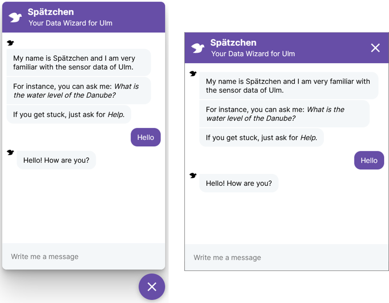
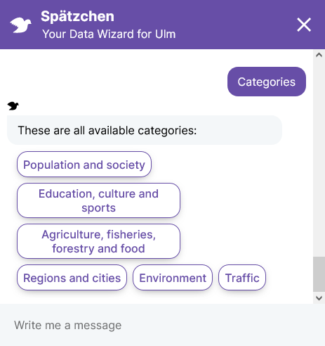
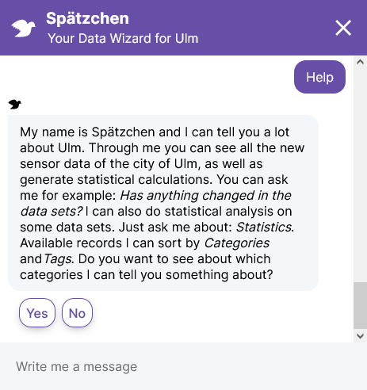
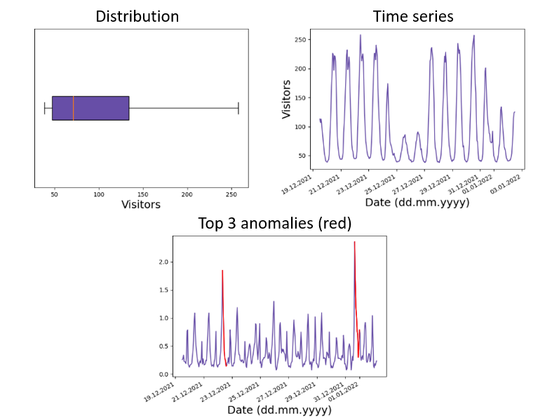

# MA Fabian Lette Chatbot

Dieses Projekt entstand im Rahmen der Masterarbeit von Fabian Lette an der Hochschule Neu-Ulm.

## Das Projekt

Die Ulmer Datenplattform stellt Sensordaten der Stadt Ulm mithilfe einer REST API zur Verfügung. Die Präsentation dieser Daten erfolgt in Rohform. Um die Einstiegshürden der Datenplattform zu minimieren, wurde ein Chatbot entwickelt, der die Daten in natürlicher Sprache intuitiv kommunizieren kann. Ein Hauptmerkmal liegt dabei auf der einfachen Erweiterbarkeit, da die Datenplattform in Zukunft wachsen könnte. Neben einer klassischen Frage-Antwort-Methodik eines Sprachassistenten, kann der Chatbot den Nutzer zusätzlich durch die Erstellung von Grafiken führen. Der Chatbot kann als Web-Widget in jeden HTML-Code eingefügt werden. Das Chatfenster ist responsive:

Der Chatbot verfügt als Interaktionsmöglichkeit über ein NLU-Modul, das den Nutzerinput Intents zuordnen kann. Außerdem können an manchen Bereichen bereitgestellte Buttons genutzt werden. Zusätzlich kann eine Hilfe-Funktion aufgerufen werden, sollte ein Nutzer nicht wissen, welche Fragen dem Chatbot gestellt werden können:

Statistische Auswertungen können generiert und ausgegeben werden, sobald die Statistik-Action aufgerufen wird. Dafür muss ein Datensatz sowie ein Zeitraum ausgewählt werden. Sobald dies geschehen ist, wird ein Boxplot, ein Liniendiagramm sowie eine Anomalienanalyse nach Matrix Profile ausgegeben:

## Getting started

Navigiere zum Verzeichnis, in dem sich die docker-compose Datei befindet.

Es muss sichergestellt werden, dass alle Daten innerhalb des Ordners "bot" zum Linux-Nutzer "rasa" gehören. Unter Windows ist dies nicht notwendig.

    sudo adduser rasa
    sudo chown -R rasa:rasa bot

docker-compose starten:

    docker-compose up --build

Der Rasa Server startet, merkt aber an, dass kein trainiertes Modell gefunden werden konnte. Um ein neues Modell zu trainieren, muss in einem weiteren CLI-Fenster folgender Befehl eingegeben werden:

    docker exec <name_des_rasa_docker_containers> rasa train

Der Server muss nun neu gestartet werden (CTRL + C und docker-compose up). Das neu trainierte Modell wird nun verwendet.

## Verwendung

Der Chatbot kann im Browser der Wahl geöffnet werden. Alternativ kann der Webserver-Port in der docker-compose Datei angepasst werden.

    localhost:80
